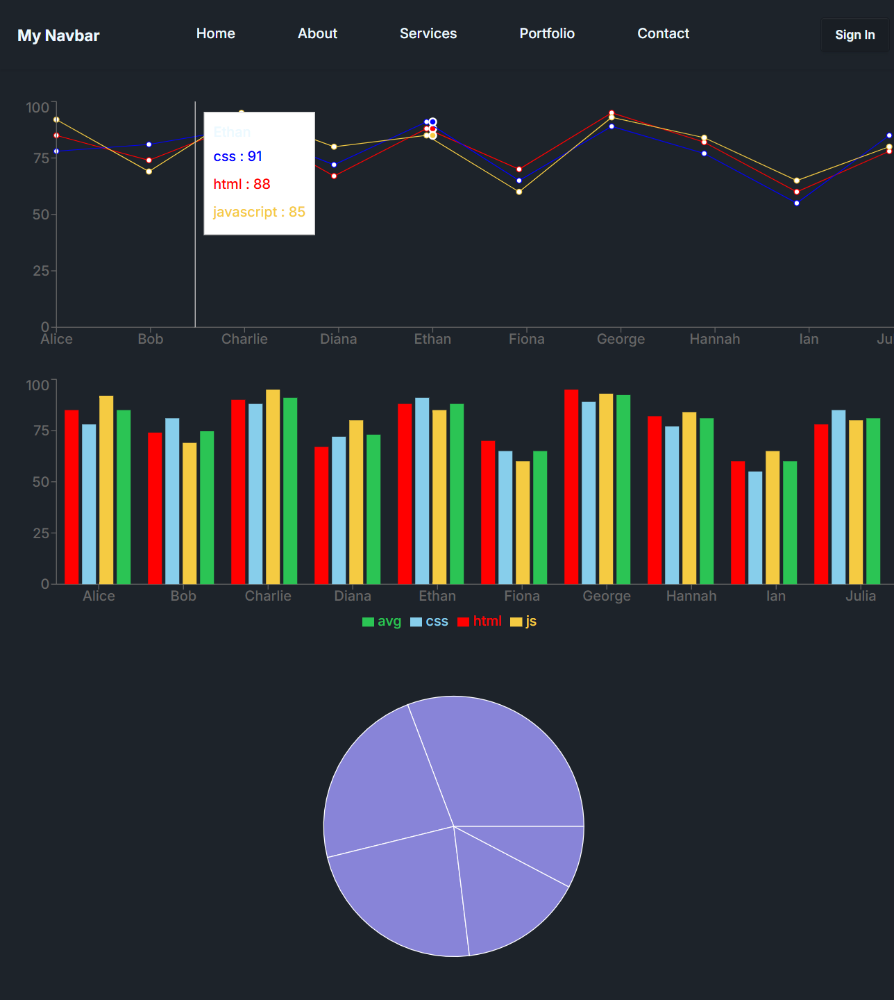

# React Charts Project

A learning project in **React** focused on creating **interactive charts** using **Recharts**. This project helps practice data visualization, dynamic chart rendering, and interactive UI components in React.

## Features

- Built with **React** and **Recharts**
- Displays **Line, Bar, and Pie charts**
- Uses **dynamic data** to populate charts
- Interactive elements like **tooltips** and **legends**
- Fully responsive and customizable

## Technologies Used

- **React**
- **Recharts**
- **JavaScript**
- **CSS / Tailwind CSS** (optional styling)

## Purpose

The main objective of this project is to **learn data visualization in React** and gain hands-on experience with:

- Mapping data to charts
- Managing chart state and props
- Making charts interactive and user-friendly
- Exploring different chart types, including **Pie charts**

## About Learning Pie Charts

Recently, I added a **Pie chart** to this project, which was a fun and exciting part of the learning process 🎨.  
Pie charts helped me understand how to:

- Represent proportions visually  
- Use `ResponsiveContainer` for auto-resizing  
- Add tooltips and labels for better interactivity  
- Customize slice colors and legends  

This addition made learning charts even more engaging and enjoyable!

## Screenshots
;
